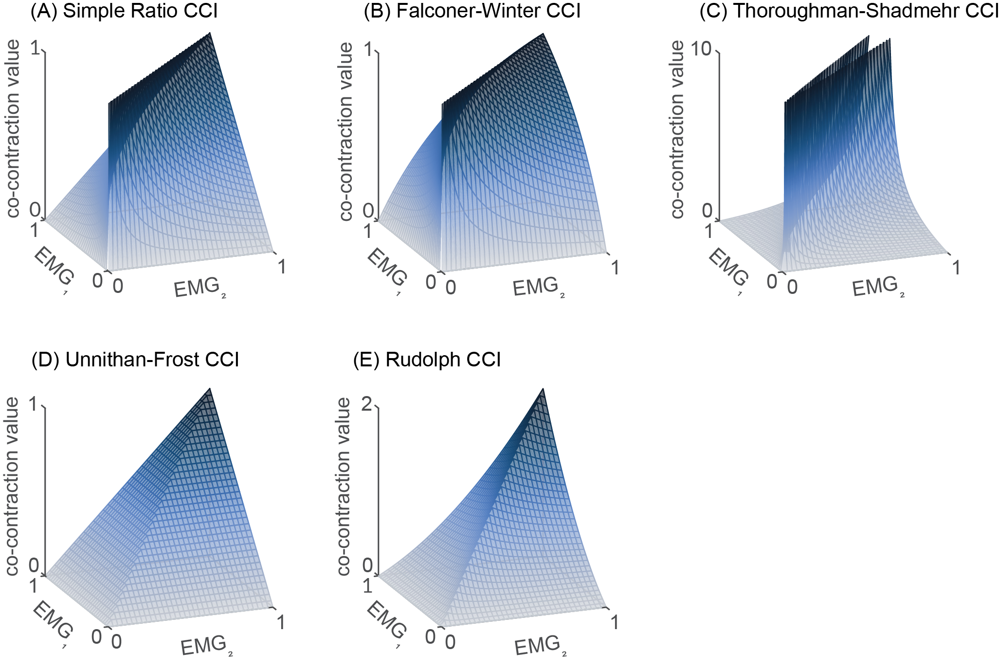
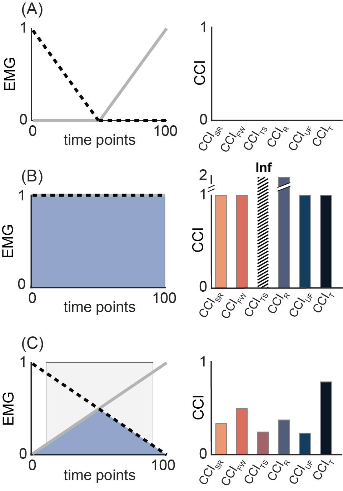
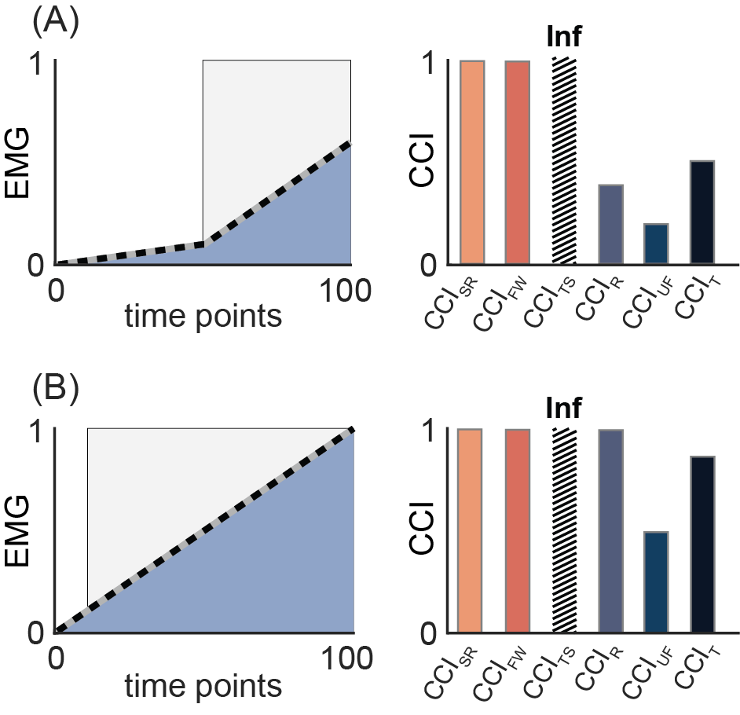

# Comparison of Co-contraction Indices
This repository contains the code for generating any analyzing all synthetic EMG data used in "A comparative analysis of co-contraction indices using synthetic EMG data: Implications for selection and interpretation." (2026) by Hannah D. Carey, Friedl De Groote, and Andrew Sawers
Preprint: doi: https://doi.org/10.64898/2026.02.03.703489, in review, PLOS One.

Running the [main script](script_MAIN_compareCCIs.m) will reproduce the figures and results from the manuscript. The code is self-contained except for the following external dependecies:

## Required functions from other sources: 
- Chatterjee's correlation from MATLAB file exchange: [https://www.mathworks.com/matlabcentral/fileexchange/112530-chaterjee-s-xi-correlation]
- Scientific color maps: [https://zenodo.org/records/] or [www.fabiocrameri.ch/colourmaps]
- Hatch fill: [https://www.mathworks.com/matlabcentral/fileexchange/53593-hatchfill2]

# Manuscript Highlights:
This study evaluated the behavior and interrelationships of six commonly used co-contraction indices (CCIs) to develop practical recommendations for their selection, calculation, and interpretation. Synthetic EMG-like signals were generated and used to evaluate CCI behavior across a range of conditions that would be difficult to achieve experimentally. Based on their formulas and observed behavior, CCIs were sorted into three categories: 
* **shape-based CCIs** increase when two EMG signals have similar shapes, regardless of amplitudes
* **amplitude-driven CCIs** increase when activation is high in both muscles
* **temporal indices** increase as the duration of EMG overlap increases, regardless of signal shape or amplitude

Correlation analyses showed stronger associations within-category than between-category, supporting the proposed classification scheme. CCI behavior yielded three principal findings, each paired with a practical recommendation (see proposals below). These results provide initial guidance for selecting, calculating, and interpretating CCIs, and they establish a framework for testing the robustness of these theoretical findings using experimental EMG from diverse tasks, muscle pairs, and populations.

## Classification of Co-contraction Indices: 

**Figure 5.** 3D surface plots depicting all possible values of each co-contraction index (CCI) for any combination of EMG1 and EMG2. Note the differences in shape, and thus behavior, of the CCIs. Panels A-C exhibit a dark blue “ridge” of high co-contraction whereas panels D and E possess a “sharp point” or peak of high co-contraction. The Simple Ratio (A), Falconer-Winter (B), and Thoroughman-Shadmehr (C) CCIs all return high co-contraction values when the two EMG signals have a similar value or shape, even when their amplitude is low (hence the “ridge”). These three indices are therefore termed shape-based CCIs. In contrast, the Unnithan-Frost and Rudolph CCIs both require high amplitude to produce high levels of co-contraction (hence the distinct peak-like feature in their surface plots). Because these two CCIs are primarily influenced by signal amplitude and require high activation in both muscles to produce large co-contraction values, they are termed amplitude-based CCIs. The temporal CCI is not included in the 3D surface plots because it does not vary with EMG amplitude. As CCI formulas do not all have the same maximum, y-axis limits in the surface plots vary.

## Generation of Synthetic EMG data:

**Figure 7. Samples of randomly generated synthetic EMG signals used to quantify correlations between co-contraction indices.**

For correlations between CCIs, we generated 3000 pairs of randomly generated synthetic EMG: 
* 1000 pairs of linear functions
* 1000 pairs of 2nd order polynomials
* 1000 pairs of sinusoids

All synthetic EMG signals were rectified to remove negative values; signals with a maximum amplitude greater than 1 were scaled to span 0 to 1

## Proposal 1: Different amplitude normalization techniques alter the magnitude and interpretation of co-contraction indices: 

### Recommendation: Because the effect of amplitude normalization on co-contraction varies by index, studies should assess the sensitivity of their results to different normalization techniques when possible.

**Figure 9. Amplitude normalization influences each CCI in distinct ways.** In panels A and B, the amplitude of EMG1 (solid black lines) is fixed, while that of EMG2 varies to represent three amplitude normalization conditions: non-normalized (dotted line, maximum amplitude 1.4), within-task normalization (dash-dotted line, maximum amplitude 1), and MVC normalization (dashed line, maximum amplitude 0.6). Panels C and D show bar plots of co-contraction values for all six CCIs, calculated from the three EMG1 and EMG2 combinations in panels A and B. Amplitude-driven CCIs (i.e., Rudolph and Unnithan-Frost) are most affected when amplitude normalization reduces both EMGlow and total EMG (panel C). In contrast, shaped-based CCIs, like Falconer-Winter, are most sensitive when normalization alters only one of EMGlow and total EMG (panel D). Abbreviations: CCISR: simple ratio; CCIFW: Falconer-Winter; CCITS: Thoroughman-Shadmehr; CCIR: Rudolph; CCIUF: Unnithan-Frost; CCIT: temporal.

## Proposal 2: Co-contraction estimates calculated from different indices are not directly comparable.

### Recommendation: Avoid direct comparisons of co-contraction values derived from different indices. Instead, evaluate relative trends with respect to each index’s theoretical maximum to ensure fair, meaningful comparisons across CCIs.

**Figure 10. Under identical conditions, different indices yield different co-contraction values.** Panels A-C illustrate three levels of overlap between two synthetic EMG signals plotted as a solid grey line and a dashed black line (A: none, B: complete, C: partial). Overlap is shown by the shaded blue regions, with corresponding bar graphs presenting the co-contraction values derived from each index for the three conditions. Light gray shading indicates periods of co-contraction identified by the temporal CCI. (A): In the absence of overlap, all CCI correctly return a value of zero. (B): Under complete overlap, all CCIs indicate “maximum” co-contraction, but the Thoroughman-Shadmehr (CCITS) and Rudolph (CCIR) indices return higher numerical values. Because indices have different theoretical maximums, these higher values should not be misinterpreted as “more” co-contraction than the other indices, but rather as “full” co-contraction. (C): Under partial overlap co-contraction values differ across indices. Subsequently, direct comparisons of indices’ absolute values should be avoided. Abbreviations: CCISR: Simple Ratio; CCIFW: Falconer-Winter; CCITS: Thoroughman-Shadmehr; CCIR: Rudolph; CCIUF: Unnithan-Frost; CCIT: Temporal.

## Proposal 3: The choice of co-contraction index should be aligned with hypothesized change (or difference) in EMG signals.

### Recommendation: Match the co-contraction index to the co-contraction concept and thus EMG feature of interest – use a shape-based index (e.g., Falconer-Winter) when signal similarity is prioritized, and an amplitude-driven index (e.g., Rudolph) when differences in signal magnitude and duration are expected.

**Figure 11. Align the choice of CCI with the EMG feature expected to change or differ.** Synthetic EMG signals are plotted as solid gray and dashed black lines, with overlapping regions shaded blue. Light gray shading indicates periods of co-contraction identified by the temporal CCI. Corresponding bar graphs display the co-contraction values calculated from each index under each condition. Because of their sensitivity to signal similarity, shape-based CCIs (i.e., CCISR, CCIFW, CCITS) – but not amplitude-driven (e.g., CCIR, CCIUF) or temporal CCIs – return identical values in panels A and B, indicating “complete” co-contraction despite differences in signal amplitude. In contrast, amplitude-driven, but not shape-based CCIs reveal their sensitivity to signal amplitude by producing smaller co-contraction values in panel A than in B. Variations in co-contraction due to signal similarity are best detected with shape-based CCIs, whereas differences in co-contraction arising from changes in signal amplitude are better captured with amplitude-based CCIs. Abbreviations: CCISR: simple ratio; CCIFW: Falconer-Winter; CCITS: Thoroughman-Shadmehr; CCIR: Rudolph; CCIUF: Unnithan-Frost; CCIT: temporal.

